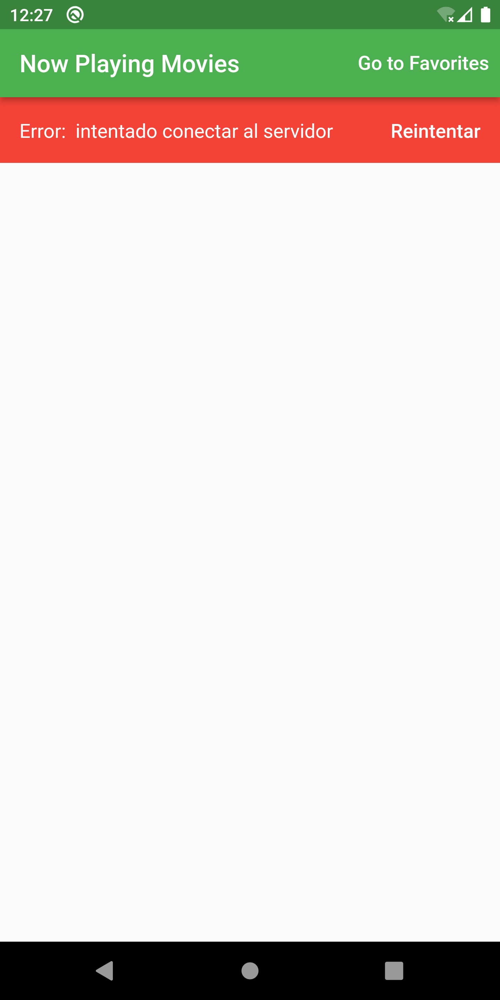

# Flutter Movie App

A flutter app using the The Movie Database API:

- https://www.themoviedb.org/

## Screenshots

</img>
</img>

## Setup

Add a .env file to the root directory and the content should be:
API_KEY=your API KEY here

## Libraries used

- Stacked (State Managment)
- Provider
- AutoRoute for routing
- Dio for Http Calls
- flutter_dotenv for enviroment variables
- flutter_raiting_bar for ui
- dartz for managing methods responses
